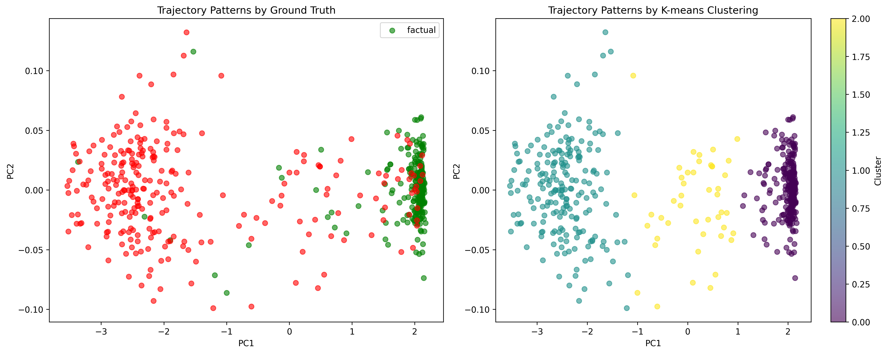
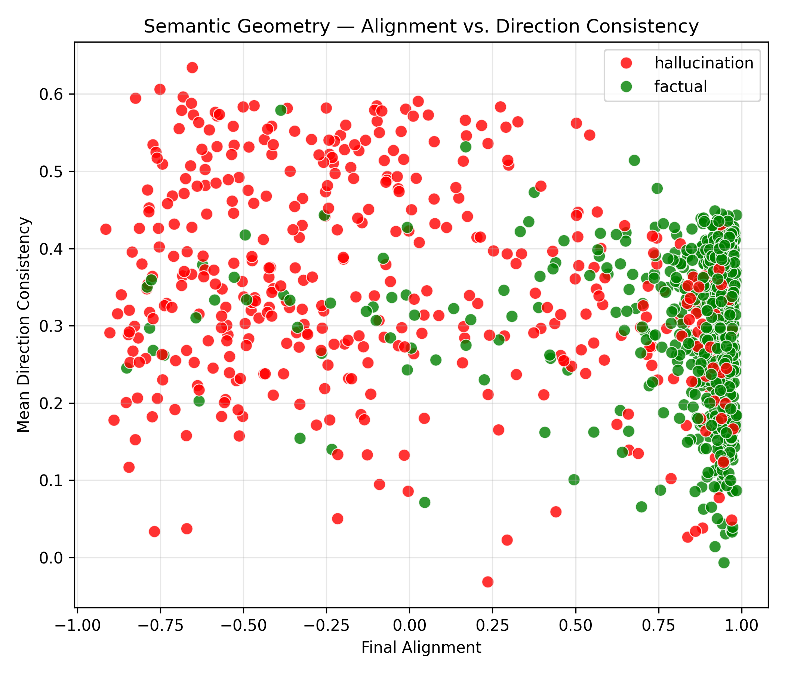
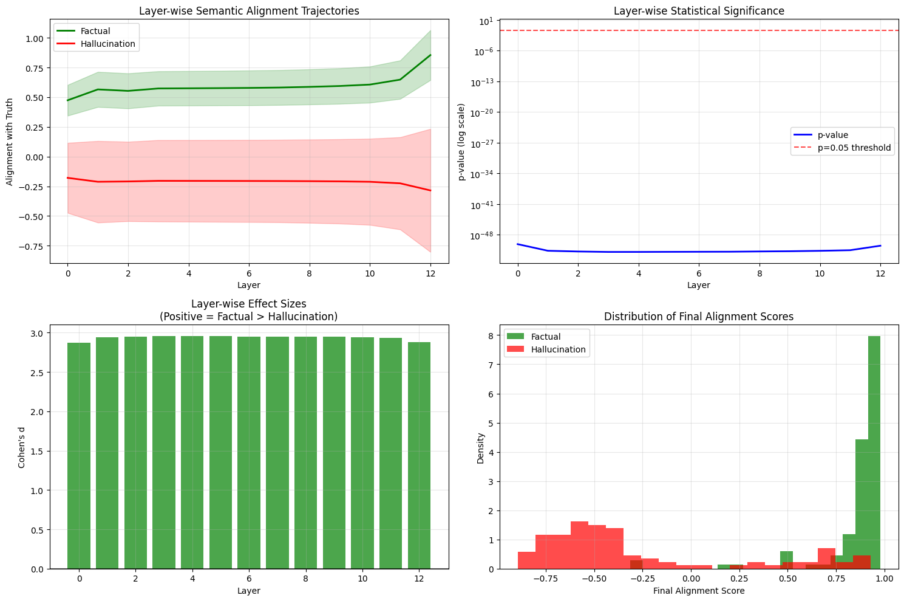
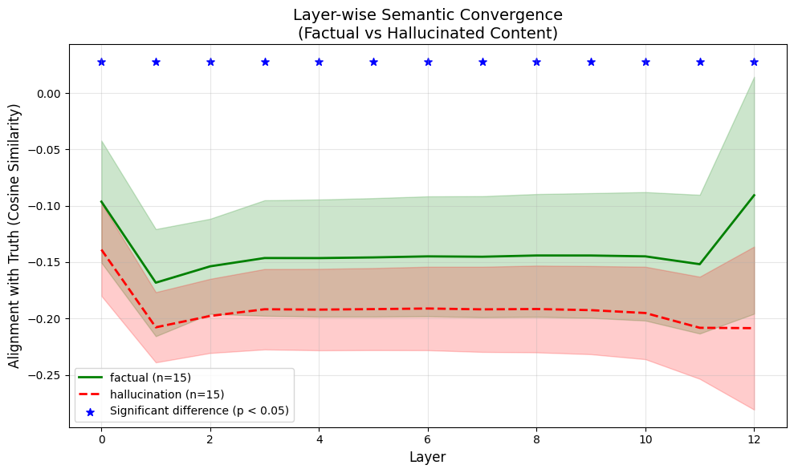

<div align="center">

# Layer-wise Semantic Dynamics

**A geometric framework for detecting hallucinations in large language models**

[](https://arxiv.org/abs/XXXX.XXXXX)
[](https://www.python.org)
[](https://pytorch.org)
[](LICENSE)
[](https://colab.research.google.com/github/sirraya-labs/lsd/blob/main/lsd.ipynb)

[Paper](https://arxiv.org/abs/XXXX.XXXXX) • [Demo](#getting-started) • [Results](#performance) • [Documentation](#how-it-works)

</div>

## What is LSD?

Large language models hallucinate—they generate plausible-sounding but factually incorrect content. Existing detection methods rely on expensive multi-sampling strategies or external knowledge bases. **Layer-wise Semantic Dynamics (LSD)** takes a fundamentally different approach.

LSD analyzes how semantic representations evolve across the internal layers of transformer models. By tracking the geometric trajectory of hidden states and measuring their alignment with ground-truth embeddings, LSD reveals a striking pattern:

> **Factual content converges toward truth. Hallucinated content drifts away.**

This geometric signature enables real-time hallucination detection using only a single forward pass—no external databases, no multiple samples, no computational overhead.

<p align="center">
  
</p>

## The Core Insight

Traditional approaches treat language models as black boxes, checking outputs against external sources or analyzing variance across multiple generations. LSD looks inside.

### The Geometry of Truth

As information flows through transformer layers, the model's internal representations trace a path through semantic space. LSD discovers that:

- **Factual statements** maintain stable, monotonic alignment with truth embeddings across layers
- **Hallucinations** exhibit early pseudo-convergence followed by systematic drift in deeper layers
- **Uncertainty** manifests as geometric instability in the trajectory curvature

By training lightweight projection heads with contrastive learning, LSD learns to map layer-wise hidden states to a shared semantic space where this geometric pattern becomes maximally visible.

<p align="center">
  
</p>

## How It Works

### Semantic Projection

For each transformer layer, LSD learns a projection function that maps hidden states to a shared semantic space where factual and hallucinated content exhibit distinct geometric patterns.

### Contrastive Alignment

Training uses a margin-based contrastive objective that pulls factual representations toward ground-truth embeddings while pushing hallucinations away, creating maximum geometric separation.

### Trajectory Analysis

At inference, LSD computes geometric features across the layer-wise trajectory:

- **Alignment Gain** — Rate of convergence toward truth manifold
- **Trajectory Curvature** — Geometric stability of the semantic path
- **Convergence Depth** — Layer at which maximum alignment is achieved
- **Drift Magnitude** — Deviation in deeper layers

These features feed a simple classifier that achieves state-of-the-art detection with minimal computational cost.

<p align="center">
  
</p>

## Performance

LSD achieves superior performance across multiple benchmarks while requiring only a single forward pass:

<div align="center">

| Method | F1 Score | AUROC | Forward Passes | Speedup |
|:-------|:--------:|:-----:|:--------------:|:-------:|
| **LSD (ours)** | **0.921** | **0.959** | **1** | **1×** |
| SelfCheckGPT | 0.847 | 0.892 | 20+ | 0.05× |
| Semantic Entropy | 0.863 | 0.901 | 10+ | 0.1× |

</div>

### Unsupervised Detection

Even without labeled training data, LSD's geometric features enable clustering-based detection with **89.2% accuracy**—demonstrating that the factual/hallucinated distinction is geometrically fundamental, not learned.

<p align="center">
  
</p>

## Getting Started

LSD is designed for simplicity. The entire framework is contained in a single Python file that runs in any environment—locally, in Jupyter notebooks, or directly in Google Colab.

```python
# Install dependencies
!pip install torch transformers sentence-transformers scikit-learn

# Run LSD
from lsd import LayerwiseSemanticDynamics

# Initialize with any transformer model
detector = LayerwiseSemanticDynamics(
    model_name="gpt2",
    truth_encoder="sentence-transformers/all-MiniLM-L6-v2"
)

# Train on your data
detector.train(statements, labels, epochs=10)

# Detect hallucinations
is_hallucinated = detector.predict("The Eiffel Tower is in Berlin.")
# Returns: True (hallucination detected)
```

<div align="center">

[](https://colab.research.google.com/drive/1VA8InoxOFqR-udiMYxQ7Glq9KgQxqcKE?usp=sharing)

</div>

## Key Advantages

**Model-Agnostic** — Works with any transformer architecture  
**Zero External Dependencies** — No fact-checking databases or API calls required  
**Real-Time Inference** — Single forward pass enables production deployment  
**Interpretable** — Geometric features provide human-understandable explanations  
**Training Efficient** — Lightweight projection heads train in minutes on a single GPU

---

<div align="center">

**Developed by [Sirraya Labs](https://sirraya.org)**

MIT License • [LICENSE](LICENSE)

*"Truth has geometry."*

</div>