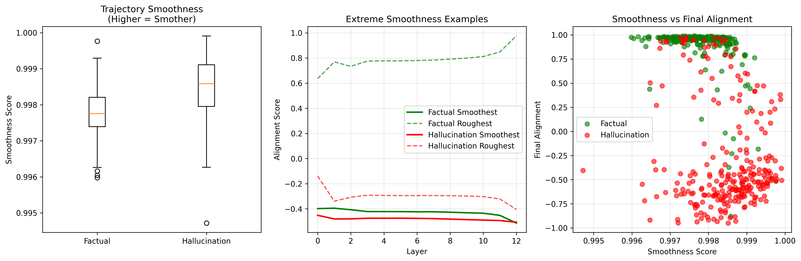

# Layer-wise Semantic Dynamics (LSD)

**Geometric Hallucination Detection in Large Language Models**

[](https://arxiv.org/abs/XXXX.XXXXX)
[](https://www.python.org/downloads/)
[](https://pytorch.org/)
[](https://huggingface.co/transformers/)
[](https://opensource.org/licenses/MIT)

> Single-forward-pass hallucination detection through geometric analysis of semantic trajectories. LSD reveals how factual and hallucinated content diverge in the hidden-state geometry of transformer models.

---

## Overview

**Layer-wise Semantic Dynamics (LSD)** is a geometric framework for hallucination detection in large language models (LLMs). Instead of relying on external fact-checking or multiple sampling passes, LSD analyzes how internal semantic representations evolve across transformer layers.

**Core idea:** Track the semantic trajectory of hidden activations across layers.

**Training objective:** Margin-based contrastive alignment between model hidden states and ground-truth embeddings.

**Key insight:** Factual statements maintain stable layer-wise alignment; hallucinations exhibit semantic drift.

**Result:** Real-time hallucination detection with interpretability and 5–20× speedup over sampling-based methods.

<p align="center">
  
</p>

---

## Installation

Clone the repository and install dependencies:

```bash
git clone https://github.com/sirraya-tech/Sirraya_LSD_Code.git
cd Sirraya_LSD_Code
pip install -r requirements.txt
```

Manual installation:

```bash
pip install torch transformers sentence-transformers datasets scikit-learn matplotlib seaborn tqdm pandas numpy
```

---

## Quick Start

### Run Layer-wise Semantic Dynamics

```bash
python run_lsd.py --config configs/lsd_hybrid.yaml
```

### Evaluate Results

```bash
python analyze_results.py --input results/ --plots plots/
```

All logs, model weights, and metrics will be saved automatically to:

```
layerwise_semantic_dynamics_system/
  ├── models/
  ├── results/
  ├── plots/
  └── execution.log
```

---

## Results

| Metric | Logistic Regression | Random Forest | Gradient Boosting |
|:-------|:-------------------:|:-------------:|:-----------------:|
| **F1-score** | **0.9215** | 0.8602 | 0.8723 |
| **AUROC** | **0.9591** | 0.9510 | 0.9475 |
| **Composite Score** | **0.9204** | 0.8663 | 0.8749 |
| **Clustering Accuracy (unsupervised)** | **0.892** | — | — |

LSD consistently outperforms SelfCheckGPT and Semantic Entropy while requiring only a **single forward pass**.

---

## Project Structure

```
Sirraya_LSD_Code/
│
├── configs/                       # Model and training configurations
├── data/                          # Synthetic + TruthfulQA datasets
├── layerwise_semantic_dynamics/  
│   ├── extractor.py               # Hidden-state extraction from LLM
│   ├── contrastive_trainer.py    # Contrastive projection training
│   ├── metrics.py                 # Evaluation and statistical metrics
│   └── visualizer.py              # Plot generation and layerwise analysis
│
├── results/                       # Output CSVs and summaries
├── plots/                         # Figures for paper
├── run_lsd.py                     # Main entry point
└── analyze_results.py             # Post-hoc analysis and plotting
```

---

## Configuration

Example configuration file (`configs/lsd_hybrid.yaml`):

```yaml
model_name: gpt2
truth_encoder_name: sentence-transformers/all-MiniLM-L6-v2
shared_dim: 512
epochs: 10
batch_size: 4
learning_rate: 5e-5
margin: 0.2
num_pairs: 1000
datasets:
  - synthetic
  - truthfulqa
```

---

## Visualization

<p align="center">
  
  <br>
  <em>Layer-wise semantic alignment trajectories and statistical separation between factual and hallucinated samples.</em>
</p>

<p align="center">
  
  <br>
  <em>2D PCA of semantic trajectories (left: ground truth, right: unsupervised clustering).</em>
</p>

---

## Key Findings

- Factual samples exhibit monotonic semantic convergence toward the truth manifold.
- Hallucinations show early pseudo-convergence followed by divergence in deeper layers.
- Alignment gain and convergence depth are strong discriminative indicators of factuality.
- LSD operates fully model-intrinsically, requiring no external knowledge base.


---

## License

This project is licensed under the [MIT License](https://opensource.org/licenses/MIT).

© 2025 Sirraya Labs. All rights reserved.

---

## Acknowledgements

This work was conducted at Sirraya Labs, with gratitude to the open-source NLP community for providing pretrained models, datasets, and tools used in this research.

---

<p align="center">
  <strong>"Truth has geometry."</strong>
  <br>
  Layer-wise Semantic Dynamics, 2025
</p>